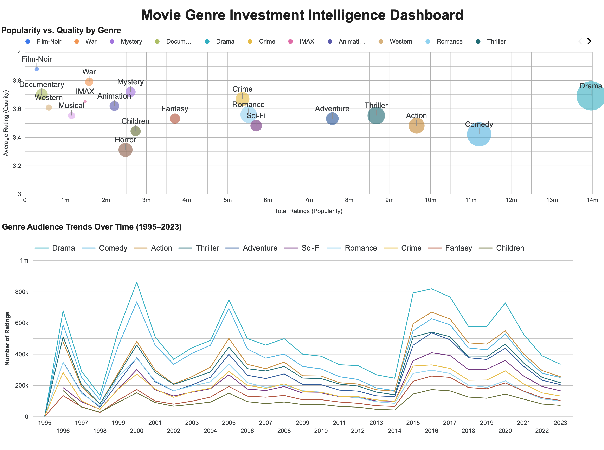

# Movie Genre Audience Insights Pipeline

A data engineering capstone project that transforms MovieLens ratings into genre-level audience insights for content strategy teams. It does not estimate financial ROI directly — instead, it provides a decision-support view of long-term genre engagement and the relationship between audience engagement (rating volume) and perceived quality (average rating)

## Problem Statement

Content companies invest millions in genre-specific productions without clear data on long-term audience trends or the relationship between popularity and quality. This pipeline ingests, processes, and visualizes 32 million movie ratings to answer two core business questions:

1. **Which genres have sustained strong audience engagement (rating activity) over time?**
2. **Does popularity correlate with quality — are the most-rated genres also the highest-rated?**

## Live Dashboard

🎬 [Movie Genre Investment insights Dashboard](https://lookerstudio.google.com/u/0/reporting/14670535-447b-425a-978a-8803f1f2ffa9/page/UsrsF)



## Data Notes

**2014 Rating Dip:** The line chart shows a noticeable drop in ratings around 2014 followed by a sharp recovery in 2015. This likely reflects the **MovieLens v4 platform transition** (November 2014), which significantly changed the user interface and recommendation system. This pattern is consistent with platform migration effects noted in GroupLens research. User activity temporarily dropped during the transition and recovered as users adapted to the new platform. This dip should be interpreted as a platform behavior artifact rather than a data quality issue.

## Architecture
```
MovieLens 32M (Source)
        ↓
   Kestra (Orchestration)
        ↓
Google Cloud Storage (Data Lake)
        ↓
Apache Spark (Genre Exploding + BigQuery Write)
        ↓
BigQuery raw.ratings_with_genres (Partitioned by MONTH, Clustered by genre)
        ↓
dbt Staging → Intermediate → Marts
        ↓
Looker Studio Dashboard (2 tiles)
```

## Tech Stack

| Layer | Tool | Purpose |
|---|---|---|
| Infrastructure (IaC) | Terraform | Provisions GCS bucket and BigQuery datasets |
| Orchestration | Kestra | End-to-end pipeline orchestration |
| Data Lake | Google Cloud Storage | Raw CSV storage |
| Processing | Apache Spark | Genre exploding, type casting, BigQuery write |
| Data Warehouse | BigQuery | Partitioned + clustered tables |
| Transformation | dbt | Staging → Intermediate → Marts layers |
| Visualization | Looker Studio | 2-tile interactive dashboard |
| Containerization | Docker Compose | Kestra + Spark runtime |

## Dataset

[MovieLens 32M](https://grouplens.org/datasets/movielens/32m/) — 32 million ratings across 87,000+ movies by 200,000+ users. Published by GroupLens Research.

## Data Warehouse Design

The BigQuery table `raw.ratings_with_genres` is:
- **Partitioned by MONTH** on `rating_timestamp` — enables efficient time-based queries and reduces scanned data
- **Clustered by genre** — optimizes genre-level aggregations used throughout the dbt models

This design directly supports the upstream analytical queries: filtering by time period and grouping by genre.

## dbt Transformations
```
├── staging/
│   └── stg_ratings_with_genres.sql      # Rename columns, type casting
│                                        # Grain: one row per user-movie-genre event
                                           (Note: ratings are exploded across multiple genres per movie)
├── intermediate/
│   └── int_genre_ratings.sql            # Aggregate by genre + year
│                                        # Grain: one row per genre-year
└── marts/
    ├── mart_genre_trends.sql            # Genre audience trends over time → Line chart
    │                                    # Grain: one row per genre-year
    └── mart_quality_vs_popularity.sql   # Popularity vs quality by genre → Scatter chart
                                         # Grain: one row per genre
```

Key transformation decisions:
- Ratings are deduplicated using `COUNT(DISTINCT CONCAT(user_id, '_', movie_id))` per genre to avoid double-counting from the genre explode step
- Genres with value `(no genres listed)` are excluded from marts

## Reproducibility

### Prerequisites

- GCP account with billing enabled
- Docker Desktop (8GB memory recommended)
- Terraform
- Python + pip

### Step 1 — GCP Setup

1. Create a GCP project and enable the following APIs:
   - Cloud Storage API
   - BigQuery API
2. Create a service account with **Storage Admin** and **BigQuery Admin** roles
3. Download the JSON key and place it at `credentials/gcp-key.json`

### Step 2 — Infrastructure
```bash
cd terraform
terraform init
terraform apply
```

This provisions:
- GCS bucket: `movie-investment-pipeline-data-lake`
- BigQuery datasets: `raw`, `analytics`, `analytics_staging`, `analytics_intermediate`, `analytics_marts`

### Step 3 — Configure Kestra

1. Start Kestra:
```bash
docker compose up -d
```
2. Open Kestra UI at `http://localhost:8080`
3. Go to **KV Store** and add the key `GCP_CREDS` with the contents of your `credentials/gcp-key.json`
4. Upload the flow from `kestra/flows/01_ingest_movielens.yml`
5. Run the flow — it will download MovieLens 32M, upload CSVs to GCS, and trigger the Spark job

> **Note:** The download step (`download_unzip_upload` task) downloads ~300MB. If you want to skip it and use pre-existing GCS data, you can disable that task in the flow.

### Step 4 — Run Spark Job (if running manually)
```bash
docker compose run --rm spark spark-submit \
  --driver-memory 4g \
  --executor-memory 4g \
  /opt/spark/work/genre_explode.py
```

This reads CSVs from GCS, explodes pipe-separated genres, joins ratings with movies, and writes the result to `BigQuery raw.ratings_with_genres`.

### Step 5 — dbt Transformations
```bash
pip install dbt-bigquery

# Configure profiles.yml
dbt init  # follow prompts: bigquery, service_account, project=movie-investment-pipeline, dataset=analytics, location=us-central1

cd dbt/movie_pipeline
dbt run
```

### Step 6 — Dashboard

Open the [live dashboard](https://lookerstudio.google.com/u/0/reporting/14670535-447b-425a-978a-8803f1f2ffa9/page/UsrsF) or connect your own Looker Studio report to:
- `analytics_marts.mart_genre_trends`
- `analytics_marts.mart_quality_vs_popularity`

## Project Structure
```
movie-investment-pipeline/
├── terraform/               # IaC — GCS + BigQuery provisioning
├── kestra/flows/            # Orchestration flow
├── spark/                   # Spark job + Dockerfile
├── dbt/movie_pipeline/
│   └── models/
│       ├── staging/
│       ├── intermediate/
│       └── marts/
├── credentials/             # GCP key (gitignored)
├── docker-compose.yml
└── README.md
```

## Evaluation Criteria Coverage

| Criteria | Implementation |
|---|---|
| Problem description | Clearly defined business problem with 2 analytical questions |
| Cloud + IaC | GCP (GCS + BigQuery) provisioned via Terraform |
| Workflow orchestration | End-to-end Kestra pipeline: download → GCS → Spark → BigQuery |
| Data warehouse | BigQuery with MONTH partitioning + genre clustering |
| Transformations | dbt with staging → intermediate → marts layers |
| Dashboard | 2-tile Looker Studio dashboard (line chart + scatter chart) |
| Reproducibility | Step-by-step setup instructions above |

## Limitations

- **Ratings are a proxy, not view counts**: MovieLens data captures user ratings, not actual watch counts. Rating volume is used as a proxy for audience interest and engagement.
- **Non-representative sample**: MovieLens users are self-selected and not representative of the global general audience.
- **Multi-label genre bias**: Films belong to multiple genres. After the genre explode step, a single rating contributes to all genres of a film — this is an intentional design choice, not a bug. Within each genre, the same user-movie pair is never counted more than once.
- **Decision-support tool**: This pipeline is not an investment recommendation engine. It provides audience signal data to inform content strategy decisions.